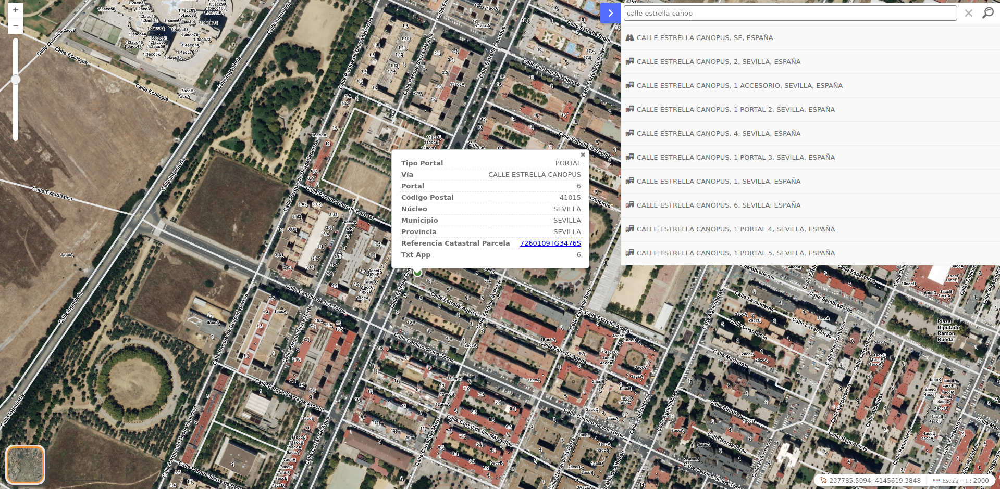

# Geocoderpelias

[](https://github.com/sigcorporativo-ja/Mapea4-dev-webpack)

## Descripción

 Plugin de [Mapea](https://github.com/sigcorporativo-ja/Mapea4) para el consumo de los servicios de geocodificación de [Pelias Geocoder](https://github.com/pelias)



Para el correcto funcionamiento del plugin es necesario pasarle en su constructor un objeto **json** con los parámetros esperados.
### Parámetros del plugin

```javascript
const configGeocoderpelias = {
  url: 'http://localhost:4000/v1/'
}
```

- **url [string]:**  url del endpoint de pelias

## Recursos y configuración

- js: geocoderpelias.ol.min.js
- css: geocoderpelias.min.css

```javascript

const configGeocoderpelias = {
  url: 'http://localhost:4000/v1/'
}

const mp = new Geocoderpelias(configGeocoderpelias);
map.addPlugin(mp);
```
<!-- ## Visor Demo
Para comprobar el funcionamiento de este plugin se puede acceder al siguiente enlace [Ejemplo Visor](https://emiliopardo.github.io/mapheader/).

## Video Demo

Para comprobar el funcionamiento de este plugin se puede descargar el [Video](https://github.com/emiliopardo/mapheader/blob/main/docs/video/mapHeader.webm?raw=true) el cual contempla la configuración y carga del plugin con diferentes cabeceras de páginas -->